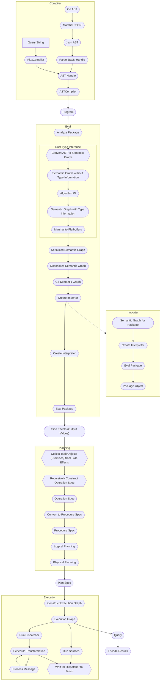

# Query Lifecycle

```mermaid
flowchart TB
    subgraph Compiler
        direction TB
        go_ast([Go AST])
        ast_marshal_json{{Marshal JSON}}
        json_ast([Json AST])
        parse_json_handle{{Parse JSON Handle}}
        query_string[Query String]
        flux_compiler{{FluxCompiler}}
        ast_handle([AST Handle])
        ast_compiler{{ASTCompiler}}
        
        go_ast-->ast_marshal_json
        ast_marshal_json-->json_ast
        json_ast-->parse_json_handle
        parse_json_handle-->ast_handle
        query_string-->flux_compiler
        flux_compiler-->ast_handle
        ast_handle-->ast_compiler
    end

    program([Program])

    ast_compiler-->program
    program-->analyze_package

    subgraph Importer
        direction TB
        semantic_graph_for_package([Semantic Graph for Package])
        create_interpreter_importer{{Create Interpreter}}
        eval_package_importer{{Eval Package}}
        package_object([Package Object])

        semantic_graph_for_package-->create_interpreter_importer
        create_interpreter_importer-->eval_package_importer
        eval_package_importer-->package_object
    end

    subgraph Eval
        direction TB
        analyze_package{{Analyze Package}}
        semantic_graph_serialized([Serialized Semantic Graph])
        deserialize_semantic{{Deserialize Semantic Graph}}
        semantic_graph_go([Go Semantic Graph])
        create_importer{{Create Importer}}
        create_interpreter{{Create Interpreter}}
        eval_package{{Eval Package}}

        semantic_graph_serialized-->deserialize_semantic
        deserialize_semantic-->semantic_graph_go
        semantic_graph_go-->create_importer
        create_importer-->create_interpreter
        create_interpreter-->eval_package

        subgraph Rust Type Inference
            direction TB
            convert_ast{{Convert AST to Semantic Graph}}
            semantic_graph_untyped([Semantic Graph without Type Information])
            algorithm_w{{Algorithm W}}
            semantic_graph_typed([Semantic Graph with Type Information])
            marshal_flatbuffers{{Marshal to Flatbuffers}}

            convert_ast-->semantic_graph_untyped
            semantic_graph_untyped-->algorithm_w
            algorithm_w-->semantic_graph_typed
            semantic_graph_typed-->marshal_flatbuffers
        end
    end
    create_importer-.->Importer

    analyze_package-->convert_ast
    marshal_flatbuffers-->semantic_graph_serialized

    side_effects(["Side Effects (Output Values)"])
    eval_package-->side_effects
    side_effects-->collect_table_objects

    subgraph Planning
        direction TB
        collect_table_objects{{"Collect TableObjects (Promises) from Side Effects"}}
        construct_operation_spec{{Recursively Construct Operation Spec}}
        operation_spec([Operation Spec])
        convert_to_procedure_spec{{Convert to Procedure Spec}}
        procedure_spec([Procedure Spec])
        logical_planning{{Logical Planning}}
        physical_planning{{Physical Planning}}

        collect_table_objects-->construct_operation_spec
        construct_operation_spec-->operation_spec
        operation_spec-->convert_to_procedure_spec
        convert_to_procedure_spec-->procedure_spec
        procedure_spec-->logical_planning
        logical_planning-->physical_planning
    end

    plan_spec([Plan Spec])
    physical_planning-->plan_spec
    plan_spec-->construct_execution_graph_object

    subgraph Execution
        direction TB
        construct_execution_graph_object{{Construct Execution Graph}}
        execution_graph_object([Execution Graph])
        run_sources{{Run Sources}}
        run_dispatcher{{Run Dispatcher}}
        schedule_transformation{{Schedule Transformation}}
        process_messages{{Process Message}}
        wait_for_dispatcher{{Wait for Dispatcher to Finish}}

        construct_execution_graph_object-->execution_graph_object
        execution_graph_object-->run_sources
        execution_graph_object-->run_dispatcher
        run_sources-->wait_for_dispatcher
        run_dispatcher-->schedule_transformation
        schedule_transformation-->process_messages
        process_messages-->schedule_transformation
        schedule_transformation-->wait_for_dispatcher
    end

    query([Query])
    encode_results{{Encode Results}}

    execution_graph_object-->query
    query-->encode_results
```
