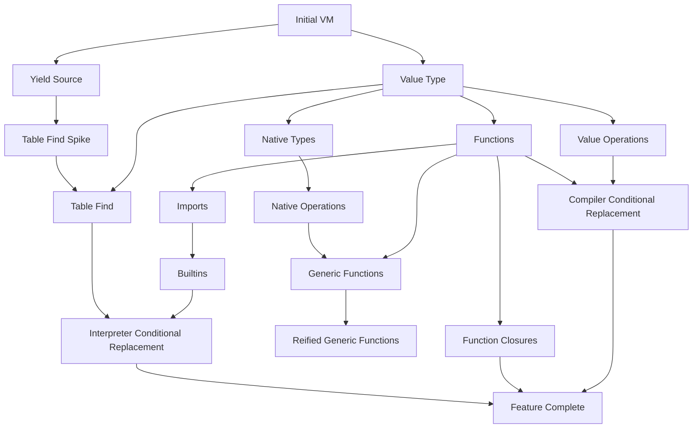

## Summary of Existing Problems

I will go into some broad categories where the existing interpreter and compiler cause issues.
This will just be a summary of ideas that I will go into further detail on.

### Performance

Performance is a broad category and likely the most obvious.
The performance problems are most heavily felt by the compiler, but some performance problems from the compiler are caused by the interpreter sending poor information to the compiler.
The performance mostly affects native flux code in tight loops such as the ones invoked by `map()` and `filter()`.
The current performance of the functions invoked by these causes substantial problems because the current speed effectively makes these functions difficult to use.
Poor performance has many knock-on effects that follow.

With poor performance, we close off the option to use native flux functions for additional language functionality because it would negatively impact the end-user experience.
For example, at the moment, we would never consider changing derivative or moving average to use a more general function.
This is because it would drastically affect the performance of these functions.
This adds up over time for developer time, complexity, and inevitably correctness as the transformations require a non-trivial amount of work to implement.

Vectorization will likely alleviate some of these issues, but there will be many places where vectorization will be difficult that make a general purpose method a larger requirement.
At the same time, the vectorization is implemented in a similar ad-hoc manner as most of the compiler.
The ad-hoc nature of the compiler makes it more difficult to understand, harder to debug, and less consistent because we now have to consider whether code is going through the vectorized path or not.
Refactoring the compiler should complement the vectorization work by adding a more formal framework for the compiler and for optimizations.
This is in contrast to treating vectorization as a specific method of optimization that partially lives outside the existing compiler.

### Complexity

The current architecture is very complex.
There are many phases and each of these phases can be linked together in ways that are sometimes difficult to understand.
There is code that runs when the interpreter executes, code that gets run by the executor afterwards, and code that gets executed in a mini-engine by `tableFind()`.
There is an interpreter and a compiler which get used at different points in the execution.
These two have overlapping functionality with sometimes different implementations.
Types get exposed to the Go runtime in different ways depending on how a particular function was created.
The interpreter does not substitute types while the compiler does.

The complexity makes it substantially more dangerous to add a new feature or to fix an existing bug.
This leads to some of the more difficult bugs just being part of flux because they are too difficult to fix without a larger investment of time.

The complexity isn't easily understood as there isn't a common language or debug tools to understand specific concepts.
Bugs are generally resolved by putting in more code to prevent a specific bug rather than to understand and fix the underlying reason why it happened.
This leads to more complexity as we will create one-off fixes in different portions of the code.

### Debuggability

The current interpreter and compiler are very hard to debug for correctness.
It's difficult to see what a particular program will do without reasoning through it and seeing the execution.
This adds developer time when making changes to the execution or attempting an optimization.

### Consistency

The current architecture creates some consistency problems.
The consistency problems then cause problems in correctness or developer understandability.
Consistency problems come from multiple angles.

The split between the interpreter and the compiler creates some issues with consistency.
In particular, similar sections of code are executed by different sections of the codebase.
When debugging some code, it can be difficult to know exactly where and how that code was executed.

There's also some functions that work differently than others.
`tableFind()` is the easiest example as it creates a mini-execution engine before or during execution.
Running a script with the interpreter executes code for non-sources/transformations, but it doesn't for sources/transformations.

The amount that a developer has to remember about the execution creates a large barrier to understanding how execution flows.
This can make some code very difficult to write or reason with.

## Proposal

I propose that we make an active effort to define and build a flux compiler and VM.

This sounds like a daunting proposal, but I believe that the work to do this would yield performance increases.
I also believe it would help the system be more consistent which would make it less complex.
By defining specific concepts and building them into a compiler and VM, we would also get improved visibility into the details of execution.

The separation of concerns between a flux compiler and a VM will require us to clearly define how concepts work and interact with each other in a consistent manner rather than writing glue code in Go for a specific workflow.

### Compiler

The purpose of the compiler would be to replace and unify the executor, interpreter, and the compiler into a single entity.
Its purpose is to translate a program into a series of instructions that would be executed by the VM.

### VM

The proposed VM is a straightforward execution.
I do not propose that the VM be advanced such as JIT compiling.
I think we would benefit from just a straight linear execution VM.
The purpose of the VM would be to just require the compiler to define how code interacts with the runtime in advance and to build the specific capabilities we need in a general way.

## Differences

It is important to list the primary differences and why these differences are significant.

### There is One Dispatcher, One Executor, and Multiple Plans

There is a single dispatcher that is responsible for running streams.
The executor, otherwise known as the VM, is also a singular entity.
The VM would construct plans during execution.
When the output of a plan is needed, that plan is passed to the planner and then executed through the dispatcher.
It is normal for multiple plans to be executed rather than have it be a special workflow.

At the current moment, each plan comes with its own executor and dispatcher.
These extra plans can run in many locations that are not consistent.
Consolidating the interaction of these different plans into a single framework makes it normal rather than special to have multiple plans in a query.

### Control Flow is Explicit

The control flow of a program is explicit and can be determined by looking only at the IR.
At the current moment, looking at the program won't tell you how it runs.
You would have to keep the knowledge about how table objects work and how it interacts with the interpreter.

As an example, here's a simple summary of looking at a script and determining the control flow.

1. Does the script invoke a function that interacts with external services such as `http.post()` or `mqtt.publish()`?
2. Does the script use a table stream in an expression statement in the main program at the top level?
3. Does the script use `yield()`?
4. Are there multiple yields? Are they named?
5. Is `tableFind()` used at the top level of a program?
6. Are any of the functions that invoke `tableFind()` at the top level?
7. What are those functions?
8. Is a stream function invoked inside something like `filter()` or `map()`?
9. Are `tableFind()` or any of the derivations inside `filter()` or `map()`?
10. Is `experimental.chain()` used?
11. What order do the streams run in? Is this even possible with the current architecture?

These probably aren't all the questions that could be asked about the workflow.
They are some of them.
It is difficult to know exactly when some section of code will run since code can be run during the interpreter phase or the execution phase.
There can also be multiple execution phases that are implicitly invoked by a function.

As an example of how this might look, we can look at the following pseudo-IR.

    define void @main() {
        %1 = func @gen.tables
        %2 = call stream %1
        yield %2, "_result"
        ret void
    }

We can see from the IR that this invokes the `gen.tables()` source which returns a stream.
We invoke the function.
We then yield the result which hands the stream over to be yielded to `_result`.

If we were to implement `tableFind`, it would be similar and interact with the VM in the same way.

    define void @main() {
        %1 = func @gen.tables
        %2 = call stream %1
        %3 = func @tableFind
        %4 = call %3, %2, ...
        print %4
        ret void
    }

While the `yield` would yield the stream to be returned to the user, invoking `tableFind` would cause the built plan to be optimized, executed, and the result would be returned.

This would also enable other applications that we presently have difficulty with.
If the above works, then we would be able to define the execution order more easily.
This would make it easier to create a more reliable version of `experimental.chain()`.

### More Consistent Naming

An underrated difference is that each of the components in this proposal would have a proper name that denotes what it does.
We would have a compiler which compiles a script into an intermediate representation.
We would have a VM that can run the intermediate representation.

We would not have both a compiler and an interpreter.
The compiler would not execute any code.
The interpreter and the executor would both be merged into the VM rather than separate concepts.
The planner would continue to exist and be invoked within the VM.

### Easier Program Analysis

Programs would be easier to analyze.
We would be able to quantify the cost of each instruction as all attributes of the program would be viewable by looking at the IR.
As we would be using a proper IR to represent the program, we would be able to use standard algorithms to analyze the control flow of the program.
Algorithms that manipulate the programs would be easier to write because each instruction would correspond to one action rather than potentially multiple operations.

For example, vectorization is a project that I believe would have been easier to implement if we had an IR.

It would also be easier to create more optimizations that rely on program analysis.
This is because we would have a control flow graph that encapsulates all operations being invoked by the VM.
We can also view the IR to manually verify the behavior is as we expect.

Consider how we have seen functions get invoked.
Invoking functions is a relatively expensive operation in Flux.
This is because we may invoke functions from a function object.
That function object may have a type signature that says, "I take x and y as an argument", but we don't necessarily know the physical order of those arguments.
This means there's a small amount of dynamicness to invoking a function that prevents a certain optimization.

Using the IR graph, we can trace the `call` invocation to reference the function object created within the same scope.
We could change the invocation to a special version of `call` that invokes the function directly with the arguments in the correct order.

    // %1 = func @add2
    // %2 = call int %1, x: 2
    %1 = call_direct int @add2, 2

With the additional information about which function we are invoking, we can instantiate the function with the proper type arguments ahead of time and prepare the arguments in the proper order to optimize function calls.

After we optimize this, we can also perform inlining.
We could decide to replace the call with the body of the `add2` function.

With our current infrastructure, we might be able to do this optimization.
It would be difficult to debug and visualize and hard to understand how different optimizations interact with each other.

Another useful optimization that specifically relates to vectorizing is how to deal with constants.
The following IR has a real cost to the `const` instruction which corresponds to our existing literal evaluators (like `floatEvaluator`).

    define int @add2(int %v) {
        %1 = const int 1
        %2 = add int %v, %1
        ret int %2
    }

This could be changed to:

    define int @add2(int %v) {
        %1 = addi int %v, 1
        ret int %1
    }

When we perform vectorization, it's easy to see the correlation to vectorization.
We could have an operation for vectorization that adds two vectors and one that adds a constant to a vector.

## Design

### VM

## Design

### Compiler

The compiler would evaluate the semantic graph from the type system and produce an IR.
The purpose of the IR is to have a common language to describe the primitive operations.
We can perform transformations on the IR before the IR is then transformed into bytecode for the VM to execute.
Looking at the IR would give a good indication of what the compiled flux script will do.

We may choose for the IR to follow a number of different possible IR styles.
The two most prominent are a stack-based machine and an SSA form.
A stack-based machine is helpful because it is more easily produced and maps more directly with different VM implementations.
At the same time, an SSA form similar to LLVM offers more opportunities for performing our own changes and optimizations because SSA forms are generally easier to work with.

It's not necessary for us to decide this at the moment and it's not really necessary for us to decide it before we begin implementation.
It is fully possible for us to decide on one form and then later decide to change that form.
The reason for this is we will have abstracted the IR and the VM to be different concepts so updating the IR would only involve changes to the compiler.

The IR format will need to be representable textually to aid with debugging.
There is no requirement that the underlying system interact with a textual IR.

A sample of a possible textual output of an IR for a Flux program follows:

    // y = 2
    // addy = (x) => x + y
    // addy(x: 1)
    define (T: Addable) T @addy(%x: T, %y: T) {
    add2:
        %1 = add T %x, %y
        ret T %1
    }

    define void @main() {
        %1 = const int 2
        %2 = func @add2, y: %1
        %3 = const int 1
        %4 = call int %2, x: %3
        print %4
        ret void
    }

Important concepts that are included in this output:

* Constants
* Function calls
* Closures
* Generics

In the above, we translate the operations at the top level into a default "main" function.
When we see a function expression, we define another function with the generic templates and create a function object that references that function along with the values included in the closure.
This ensures the function holds a copy of the value wherever it may be invoked.
We then load the parameter that will be used for the function call and invoke the function retrieving the result.
In a typical flux script, this output would not be used for anything.
For debug purposes, we add a `print` instruction to print the output.
Then we end the main function by returning void.

A compiler and a VM that runs the above would encapsulate most of a minimum-viable product.
For a minimum-viable product, we would also need to execute a function that produces a stream and have it interact with yield and the dispatcher.

### VM

The VM would be responsible for implementing the instructions from the compiler.
For the compiler to emit an instruction, it needs to be implemented in the VM.

The VM may be implemented in Go or Rust.
The only requirement on the VM is that it must be able to invoke Go functions in some way because the planner and executor are in Go.
**We will not rewrite the planner, executor, or any sources/transformations in Rust**.

We may choose to implement the VM in Rust using our own custom solution or an off the shelf one like wasmtime.
An off the shelf solution has the advantage that we will get some aspects for free, such as a JIT, tooling, and additional places where we can run the target.
A custom solution may have the advantage of simplicity that may be good enough for our purposes.
A custom solution also means that we aren't limited to an outside project for additional features we might need.
At the same time, a custom solution means we have to do everything ourselves.

I am not quite decided on which is the best option.
My current leaning is to implement the VM in Rust using wasmtime.
The IR code generation would target wasm bytecode.
We would implement a flux runtime for the wasm runtime.

#### Function Invocation

A large part of the VM is determining how to execute functions.
In the above example, we could statically determine all types that will be used and we could instantiate a version of the `addy` function that is not generic.

That isn't always possible.
When we invoke a generic function, it might be required to instantiate a generic function into a version with the proper types at runtime.
This is reification and would be a responsibility for the `call` instruction in the VM.

## Development Plan

### Summary

The focus of the development phases is to get a basic feature complete VM into production as soon as we can.
Each phase will focus on the creation of the IR and VM components first followed by the conversion of semantic graph into IR.

In general, the focus will be on replacing the interpreter first followed by the compiler.
Areas that are not implemented can fallback to the existing implementations.
If a script uses a feature that is not supported as part of the VM implementation, we can fallback to running through the interpreter.
Similarly, transformations can continue to utilize the compiler for things like filter and map.

When this project is complete, the interpreter and compiler packages will no longer be operational and can be deleted.

Due to the non-linear nature of this development, an effort has been made to diagram the development phases into a flowchart.

### Initial VM

The phase is the proof of concept for an IR and the accompanying VM.
This phase is the most important as it sets the tone for the remainder of the project.
To keep its scope limited, this phase focuses _only_ on defining an IR, getting it translated to a bytecode, and then having that bytecode executed by a VM.

The VM can be either a custom implemented one or something off the shelf, like wasmtime.
The important part is that the IR is used as a driver to generate the bytecode and the actual bytecode/VM should be disconnected from the VM implementation.
This architecture should allow us to have the IR translated into different bytecode targets.

It is important that the IR and VM are documented on how to add and implement additional instructions.
Future phases will need to add IR and VM instructions using this initial base.

The IR does need a way to visually inspect it.
Any IR generated should have a visual debug output associated with it.

The following will be true at the end of this phase:

* IR instructions for `print` and `const` exist.
* IR can be translated into bytecode.
* A VM exists that can execute the bytecode.
* A method exists to take a flux package and translate it into IR.
* The method to translate flux to the IR should ignore all statements/expressions and have a way to report that it could not generate IR for the gicen input.

### Yield Source

This phase is focused on creating and executing plans within the VM.
This involves creating procedure specs, linking them together, and then yielding the results.

See the [table-find.md](../table-find.md) for details about how plans are created and executed.

The following will be true at the end of this phase:

* IR instructions exist that allow a procedure spec to be created.
* IR instruction for yield.
* Execute yielded plan and output the results.
* A debug source and debug transformation can be created and used to demonstrate this functionality.
* An expression statement that ends in a stream should be automatically yielded instead of printed.

### Table Find Spike

This phase is focused on demonstrating that the plan execution from the previous phase can also be utilized for table find operations.
This involves creating an instruction that forces the execution of a plan and returns the result as a value.

For the sake of this phase, the returned result doesn't necessarily have to be the exact implementation of one of the table find operations.
A debug table find style operation that just does something like counting the number of tables in a stream and returning that is fine.

The important part is both demonstrating that we can execute the plan during the VM execution.
This is in contrast to yield which gets implicitly executed after the main function has been executed.
It is also important in this phase to demonstrate that we can detect when a plan node is split between multiple plans and should result in an error.

More details about that situation are in the [table-find.md](../table-find.md) planning document.

The following will be true at the end of this phase:

* IR instructions exist that will execute a plan.
* The IR instruction does not need to be useful or actually implement an existing `tableFind` function.
* It should be an error to use a procedure spec in multiple disconnected plans.
* Orphaned plan node children (ones that are included in a plan, but not actually materialized) should be detected as an error.

### Value Type 

This phase follows the creation of the initial VM.
We will create a way to represent a value type in the IR and then have a corresponding generic value type that can represent any value in the VM.

As part of this phase, additional `const` operations should be created that will create a value from a constant value.
This should correspond with the various literal nodes in the semantic graph.

Similarly, the IR generation will be capable of transforming literals to the `const` operation.

The following will be true at the end of this phase:

* A value type exists in the IR.
* A value exists in the VM.
* Types that are generic should resolve to the value type.
* Constant operations are included in the IR.
* Constant operations are implemented in the VM.

### Value Operations

This phase focuses on implementing the various builtin operations that are associated with manipulating values.
This primarily includes binary operations but also includes unary operations, member operations, index operations, etc.

The only thing this doesn't include are functions which will be handled separately.

The following will be true at the end of this phase:

* Operations manipulating values will be included in the IR.
* Operations manipulating values will be implemented in the IR.

### Table Find

This phase continues the work from the previous spike by implementing the builtins associated with table find.
These are presently `tableFind`, `getColumn`, and `getRecord`.

The output of these should be the corresponding value from the [Value Type](#value-type) phase.

### Functions

This phase focuses on manifesting functions from function expressions.
The functions can then be invoked later by a call expression.

This phase does not include reifying generic types.
In fact, generic types should resolve to being value types and therefore use value operations.
Function expressions will then create a reference to the function label.

This phase will also not include support for closures.
If a closure is encountered, the IR creation is a failure.

The following will be true at the end of this phase:

* Function definitions are emitted when a function expression is encountered.
* Function expressions will create a function value that references the function definition.
* Call expressions will invoke the function expression with the given parameters.

### Imports

This phase focuses on allowing another package to be imported.
Importing a package involves transforming that package into its own IR and bytecode so it can be referenced from the main package.

Function definitions in other packages should be able to be referenced by the main package.

The following will be true at the end of this phase:

* Imports will be processed and compiled like the main module.
* Function definitions from other packages can be referenced in the main module.

### Builtins

This phase focuses on processing builtins to the IR.
This phase may introduce some additional complications because the method by how builtins may need to be implemented in a different way.
In general, each builtin will likely have to be translated to its own set of IR instructions.

To give a general example, we can take the builtin `from`.
We might translate that builtin to a function defined in the IR like such:

    define stream @from(%bucket: string) {
        %1 = create source "influxdb.from", bucket: %bucket
        ret stream %1
    }

Rather than the `from` function being its own special implementation, it would be implemented using a more generic instruction.
This instruction has no way to be represented by flux, but would be part of the runtime implementation.

On the other hand, some builtins might translate directly to IR operations.
An example of this is the `string()` function which might get translated as:

    // v = string(v: 1)
    %1 = const int 1
    %2 = conv string %1

The following will be true at the end of this phase:

* Builtin statements will function correctly.

### Interpreter Conditional Replacement

This phase focuses on replacing usages of the interpreter with the VM.
This is a conditional replacement because we should be able to identify if the VM has implemented all features required by the script before executing it.
If the script will not successfully execute in the VM, we will fallback to the interpreter.

The following will be true at the end of this phase:

* Scripts that would normally use the interpreter will selectively use the VM when possible.
* Scripts that would not execute correctly in the VM will not run in the VM.

### Function Closures

This phase is about implementing function closures.
A function closure will capture values that are used inside a function when that function may be invoked at a later time.

The following will be true at the end of this phase:

* The compiler will be able to emit function definitions for functions with closures.
* The call operation will handle passing closure variables to the function.
* The VM will implement the logic from the IR.

### Generic Functions

It should be noted that this phase is not required for the VM to be considered feature complete.

This phase focuses on getting the performance benefits from the type system and generic functions.
It will focus on creating templates from generic functions and allowing those generic functions to be generated at the point they are used during IR generation.

This phase focuses _only_ on the situations where we can determine types at compile time.
As an example, consider the given function:

    add1 = (x) => int(v: x) + 1
    add1(x: 2)

Without generics, this may be implemented as:

    define int @add1(%x: value) {
        %1 = conv int %x
        %2 = const int 1
        %3 = add int %1, %2
        ret int %3
    }

    define void @main() {
        %1 = const int 2
        %2 = as_value %1
        %3 = call int @add1, x: %2
        print %3
    }

With generics, we may do this instead:

    define (V) int @add1(%x: V) {
        %1 = conv int %x
        %2 = const int 1
        %3 = add int %1, %2
        ret int %3
    }

    define int @add1.int(%x: int) {
        ; %1 = conv int %x // determined redundant
        %2 = const int 1
        %3 = add int %1, %2
        ret int %3
    }

This avoids the allocation from `as_value` and removes an instruction from `add1` to treat the value as an integer.

The following will be true at the end of this phase:

* The IR will have a way to represent generic function templates.
* It will be possible to generate function definitions where generic parameters are specified.
* Areas where the type can be determined statically will use the generated function definitions rather than the default generic version.

### Reified Generic Functions

It should be noted that this phase is not required for the VM to be considered feature complete.

This phase focuses on extending the performance benefits from generic functions to ones that are only determinable at runtime.
It will focus on keeping the created templates at runtime and reifying the function when it is required in generic contexts.

If successful, this will likely replace the value type in most if not all situations.
Note that we may determine that fully reifying functions at all times may not be worth it.
There are potentially situations where reifying a unique function for every shape of data is both not practical and may make performance worse.
In particular, functions that only modify a record using the `with` operator may not benefit from having a unique implementation for each potential record that can be invoked by the function.
Functions that are only invoked once, such as in the interpreter, may also not benefit from reification because the cost to do so may greatly exceed the cost of using the generic value type.

The following will be true at the end of this phase:

* Functions will be capable of being reified at runtime.
* The degree this is utilized may vary.

### Value Operations

This phase is about implementing the various operations (such as addition) as operations in the IR and the VM.

The following will be true at the end of this phase:

* All operations from the semantic graph (excluding calls) will be implemented to operate on values.

### Compiler Conditional Replacement

This phase focuses on replacing usages of the compiler with the VM.
This is a conditional replacement because we should be able to identify if the VM has implemented all features required by the function before executing it.
If the function will not successfully execute in the VM, we will fallback to the compiler.

The following will be true at the end of this phase:

* Functions that would normally use the compiler will selectively use the VM when possible.
* Functions that would not execute correctly in the VM will not run in the VM.

### Native Types

It should be noted that this phase is not required for the VM to be considered feature complete.

This phase focuses on introducing native types to the IR and utilizing those native types in the VM.
When we can definitively know that we are operating on an integer, we should generate integer specific instructions so those can be more optimized.
Part of this phase may include using native types in places where we previously used the generic value type.

The following will be true at the end of this phase:

* Functions that have a known type will use the native type instead of the value type.

### Native Operations

It should be noted that this phase is not required for the VM to be considered feature complete.

Similar to the value operations phase, this is about implementing the needed operations on the new native types.

The following will be true at the end of this phase:

* Operations on native types will use the native operations.

### Feature Complete

This phase involves confirming that the VM implements all behavior from the interpreter and compiler and is able to replace them permanently.
At this point, no more code should be executed through the interpreter and compiler packages and all existing paths are implemented.
We can remove the old implementations and switch to using the VM exclusively.

Note that feature complete does not include everything listed in this proposal.
There will be projects after feature complete is reached.

## Optimizations

The above development phases are focused on creating a feature complete compiler and VM.
The result should unify the compiler and interpreter and create a framework for further optimizations.
At this point in development, we would branch out and begin to implement the desired optimizations.

Some optimizations are purely changes to the IR while some require additional instructions so the VM can support the operations.

### Rolling Constants

Rolling constants will take constant operations and roll them into a single instruction.
As an example, we might take the following code:

    %1 = const int 2
    %2 = add int %x, %1

And we would change it to:

    %1 = addi int %x, 2

This would reduce the number of values on the stack and create a single instruction for adding a constant instead of one instruction to create the constant and another to use it.

Another aspect of rolling constants is to combine constants together.

    %1 = const int 2
    %2 = const int 4
    %3 = add int %1, %2

This becomes the following code pretty easily:

    %1 = const int 6

If this value is then used with a variable, we can also use the first described optimization to take a lot of potential instructions and collapse them into one instruction.

### Direct Calls

A direct call is a call instruction where we can statically know the location.
An indirect call requires us to perform a lookup on the function object for the order it expects arguments at runtime because we don't know how the function expects its arguments and flux uses named arguments.
A direct call allows us to perform this lookup at compile time instead.

As an example, consider the following:

    // add2 = (x) => x + 2
    // add2(x: 2)

    define int @add2(int %x) {
        %1 = const int 2
        %2 = add int %x, %1
        ret int %2
    }

    define void @main() {
        %1 = func @add2
        %2 = const int 2
        %3 = call int %1, x: %2
        print %3
    }

As we invoke `call` from the same function where we define the function object, we can statically adjust this IR to direclty call `add2` instead.

    define void @main() {
        %1 = const int 2
        %2 = call_direct int @add2, %1
    }

Note how in this second one we do not have to specify the keyword arguments.
This is because we already know the order that arguments should be supplied.

### Inlining

This optimization is more used to enable the other optimizations.
For example, say we have the following code:

    v = () => 2
    2 + v()

This might become the following IR:

    define int @v() {
        %1 = const int 2
        ret int %1
    }

    define void @main() {
        %1 = func @v
        %2 = const int 2
        %3 = call int %1
        %4 = add int %2, %3
        print int %4
    }

We first start off by rewriting the call to a direct call.

    define void @main() {
        %1 = call_direct int @v
        %2 = const int 2 
        %3 = add int %1, %2
        print int %3
    }

We recognize that the direct call might be less costly if we just inline it.

    define void @main() {
        %1 = const int 2
        %2 = const int 2
        %3 = add int %1, %2
        print int %3
    }

We now gain insight that we actually have two constants.

    define void @main() {
        %1 = const int 4
        print %1
    }

### Vectorization

We would translate the vectorization code into an IR by defining and implementing new versions of the instructions that operate on vectorized types.
