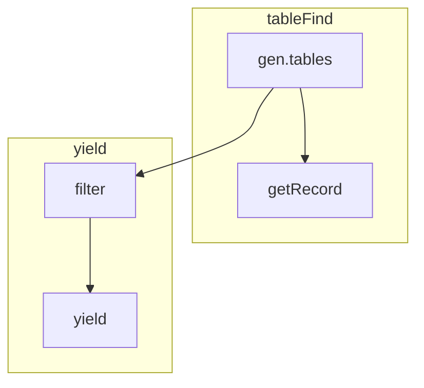
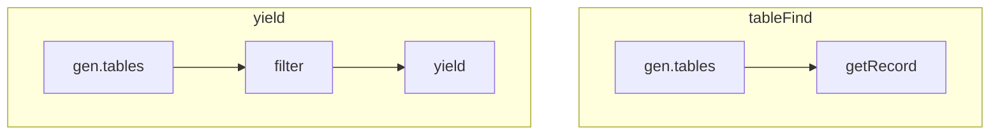

## Summary

Streams have data that we do not want to keep in memory if we do not have to.
We want to materialize the data, process it, then discard it if not needed anymore.
At the same time, we have functions that want to materialize data at different times.

As an example, here is some code:

```
import "internal/gen"

data = gen.tables(n: 100)
first = data |> getRecord(idx: 0)
data
  |> filter(fn: (r) => r._value > first._value)
  |> yield()
```
  
We can see here that `data`, which is a stream, gets passed to `getRecord`, which uses the table find functionality to invoke the stream.
Unfortunately, we then take that same stream and pass it to `filter` and `yield` using the value returned by `getRecord` to perform the filter.

What is the data flow in this query?
What is the implementation?

## Fundamental Problems

Some fundamental problems that we need to keep in mind while we design this.

1. We want to minimize the amount of data that we store in memory when possible.
2. We need to avoid situations where we can create a deadlock.
3. The solution must be internally consistent.

The first requirement is to help minimize the amount of data in memory.
We can potentially be processing a large amount of data.
For this reason, we try to stream as much of the data as we can between transformations.

This first requirement can potentially cause the second requirement.
While we want to stream, it may not always be possible in order to avoid a deadlock.
This occurs when we have one stream, but multiple readers and those readers are not aligned with each other.
The query mentioned above is an example when one stream can have multiple readers and those readers are not running concurrently.

The third requirement is there because of an issue with the current engine.
It is a reminder that the rules we make should be internally consistent and easy to understand.

### Current Engine

Before we talk about changes, it's important to first understand the current engine.
The current engine creates a new execution engine for each plan that gets invoked.
There is one global plan that is the result of the `yield()` calls and returns the results.
There can also be mini-plans that get invoked by `tableFind()`.

When we have plan nodes that are shared between these, these plan nodes are created once for each execution.
This is in contrast to the language semantics.
For the language semantics, a stream that goes to two transformations should only be executed once.
When table find type functions are involved, this semantic doesn't apply.

This is an inconsistency with the language that was mostly created by accident rather than thought through and designed.
While we are redesigning how the engine runs, it is worth designing how data is processed.

### When to start materializing data

We need to consider when we start materializing data and how it affects the decisions we make.
We can look at a query and see the resulting plan graphs.



As we can see by the resulting graph, the `gen.tables` node ends up connected to multiple plans.
The above arbitrarily puts it into the `tableFind` plan, but we could also put it in the `yield` plan.
But, the `tableFind` plan is the first one we would need to materialize because the `yield` plan is needed to return results so we are going to place it inside of `tableFind`.

There are two issues that pop up.
The first issue is how do we deal with the data that `gen.tables` will materialize?
Since `getRecord` needs to return a value and the main thread needs to wait for the result, we need to process the stream from `gen.tables`.
At the same time, `filter` is not currently executing and will not be reading from the data.
To make this situation work, we would need to buffer the messages from `gen.tables` in memory so that they can be available to be read by `filter` once filter starts executing.
An alternative is we can duplicate the `gen.tables` node and construct the following plan graphs instead.



Unfortunately, these plan graphs do not accurately represent the code and it leads to an inconsistency in how we handle table streams.
This is the method currently employed by the query engine, although it is mostly an accident.
We could decide to make this the explicit behavior if we wanted to and decided that this is the proper implementation.

There is one other problem with these methods.
It is best illustrated by an IR of the flux code.

```
define void @main() {
    %1 = call @gen.tables, n: 100
    %2 = call @getRecord, tables: %1, idx: 0
    %3 = call @filter, tables: %1, fn: <funcref>
    yield %3
}
```

You may notice the problem at the call to `getRecord` on line 2 of the IR.
The value `%2` must be materialized at that time, but we do not know the full plan graph until the end of the function when the variables go out of scope.
It is not trivial on line 2 to know if `%1` will be live after the call to `getRecord` so we are working with an incomplete plan graph.
This means we do not know _if_ we have to buffer the messages coming from `gen.tables` until we get to line 3, but we have already been forced to materialize the data on line 2.

Keeping this in mind, we can formulate a few possible solutions.

### Duplicate Nodes in Different Plans

The most trivial solution to this is to call `gen.tables` twice in the two different plan graphs demonstrated above.
If we duplicate the nodes that span multiple plans, we don't end up with any conflict in the engine itself.

We do create a consistency problem where table streams now have their invocation determined by how they are processed rather than always acting the same way everywhere.
This is the solution we currently employ and we could continue to employ it but in a more formal capacity.

### Disallow Spanning Plan Graphs

We can decide that it is impossible for nodes to span multiple plan graphs and return an error if someone attempts to do this.
This would make the query above return an error and would fix the consistency problem.
It also likely requires the least amount of work and has the most safety because implicit buffering wouldn't be required and we wouldn't need to resolve the liveness problem mentioned above.

### Add a Buffer Function to Explicitly Buffer Streams

As an extension to the previous section, **Disallow Spanning Plan Graphs**, we could add a function `buffer()` which could be used to buffer the table stream output from the transformation.
This output could then be used as a source to any other stream.

There are numerous benefits to this method:

* It is explicit.
* It does not require compiler analysis.
* It only applies in situations that are already rare.

The downside of this method is that it would be a breaking change from the current behavior by making some existing queries, which were largely incorrect anyway, into an error.

This would likely look something like:

```
data = from(bucket: "testdata")
    |> range(start: -5m)
    |> buffer()

o = data
    |> getRecord(idx: 0)
    
data
    |> filter(fn: (r) => r._value > o._value)
```

### Liveness Analysis

It is possible using an IR to analyze the liveness of variables.
Using liveness analysis, we can determine if a specific stream will terminate at a given instruction or will continue to be alive after the instruction.

If we perform this analysis on the above program IR, we can determine that `%1` continues to remain live after the call to `getRecord` and we can introduce the implicit buffering of messages to connect the plan graphs together.

This differs from the liveness of a variable according to the scope.
If we were to utilize the scope to determine the liveness of a variable, we would determine most if not all usages of streams to be live after the call to `getRecord`.
Consider the following program:

```
data = from(bucket: "testdata") |> range(start: -5m) |> getRecord(idx: 0)
from(bucket: data._value)
    |> range(start: -1h)
    |> yield()
```

This roughly translates to the following IR:

```
define void @main() {
    %1 = call @from, bucket: "testdata"
    %2 = call @range, tables: %1, start: -5m
    %3 = call @getRecord, tables: %2, idx: 0
    %4 = getmember string, %3, "_value"
    %5 = call @from, bucket: %4
    %6 = call @range, tables: %5, start: -1h
    yield %6
}
```

In this program, if we were to utilize the scope, the input for `getRecord` is `%2`.
This variable does not go out of scope until the `main` function ends.
If we were to use scope to determine liveness, then `%2` would need to buffer data in case it was used somewhere else.

On the other hand, there is a liveness analysis algorithm used to determine register allocations we could employ instead.
Using this algorithm, which I won't go into here, we could determine that `%2` is not live after the call to `getRecord`.
We could also determine the same for all other plan nodes in the call to `getRecord`.

In contrast, we could also determine which nodes continue to remain live after that call and introduce the implicit buffering.

If we were to employ some way to allow data to cross plan boundaries, this is probably the best way.

The downside to this method is you could think that it requires using liveness analysis to determine correctness rather than as an optimization.
At the same time, buffering all messages until a variable is "released" would still be correct even if not the most performant.

### Using Reference Counting to Determine Liveness

Another possible method is to use reference counting to determine if a table stream is live.
In this way, we would determine whether to buffer or not by whether we were the sole owner of a reference.

Such a method is attractive because it allows us to automatically buffer data when that is correct, but without requiring us to do liveness analysis on the program ahead of time.
Liveness analysis may not work correctly across function calls so a more reliable method of determining liveness at runtime enables this method.

The downside of this method lies in the implementation of the reference counting.
In order to properly utilize this method of determining liveness, we would have to add move semantics into the IR.
Consider the same code snippet as the one from above:

```
data = from(bucket: "testdata")
    |> range(start: -5m)

o = data
    |> getRecord(idx: 0)

data
    |> filter(fn: (r) => r._value > o._value)
```

It might look something like this:

```
define (A: Record) bool @fn.1({A with _value: int} %r, {o: {_value: int}} %_this) {
    %1 = getmember {_value: int}, move %_this, "o"
    %2 = getmember int, move %1, "_value"
    %3 = getmember int, move %r, "_value"
    %4 = gt int, move %3, move %2
    ret bool %4
}

define void @main() {
    %1 = call @from, bucket: "testdata"
    %2 = call @range, tables: move %1, start: -5m
    %3 = call @getRecord, tables: %2, idx: 0
    %4 = getmember string, move %3, "_value"
    %6 = call @range, tables: move %2, start: -1h
    %7 = call @filter, fn: @fn.1, _this: {o: {_value: move %4}}
    yield move %7
}
```

It should be noted that, with this method, liveness analysis is still required.
The decision to buffer is made at runtime by using the reference count, but the insertion of the `move` nodes would have to be inserted by liveness analysis on an individual function.
Still, it should be better at determining whether a value is live than just attempting to use liveness analysis with no runtime support.

Another potential downside of this is it complicates that overall IR to include a bunch of `move` nodes and doesn't necessarily tell us the lifetime of each value in an easy to assess way.

A potential alternative to `move` nodes is to do the opposite.
Use something like `ref` to denote when we are taking a reference to the node and assume all other calls are automatically moves.
We would then remove `ref` nodes using liveness analysis rather than add `move` nodes.
This might help to clean up the IR and reduce the burden of understanding the IR.
We might rewrite the above like so:

```
define (A: Record) bool @fn.1({A with _value: int} %r, {o: {_value: int}} %_this) {
    %1 = getmember {_value: int}, %_this, "o"
    %2 = getmember int, %1, "_value"
    %3 = getmember int, %r, "_value"
    %4 = gt int, %3, %2
    ret bool %4
}

define void @main() {
    %1 = call @from, bucket: "testdata"
    %2 = call @range, tables: %1, start: -5m
    %3 = call @getRecord, tables: ref %2, idx: 0
    %4 = getmember string, %3, "_value"
    %6 = call @range, tables: %2, start: -1h
    %7 = call @filter, fn: @fn.1, _this: {o: {_value: %4}}
    yield %7
}
```

Note that this removes all `move` references and replaces it with a single `ref` because liveness analysis would determine that `%2` is used after the call to `getRecord`.
